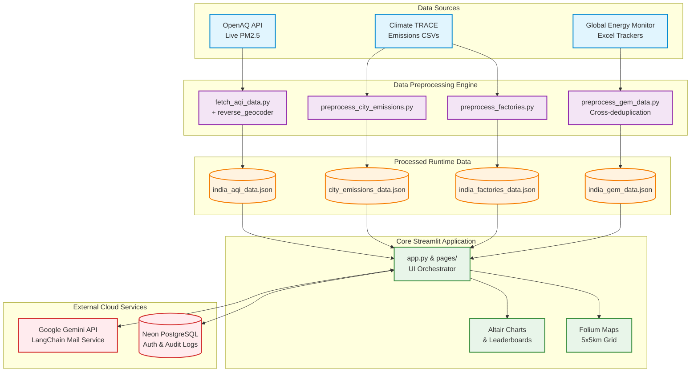

# India AQI Dashboard - Architecture Diagram

This diagram outlines the end-to-end data flow and system architecture for the India AQI Dashboard project. 

```mermaid
flowchart TD
    %% Define Styles
    classDef source fill:#e1f5fe,stroke:#0288d1,stroke-width:2px;
    classDef script fill:#f3e5f5,stroke:#8e24aa,stroke-width:2px;
    classDef data fill:#fff3e0,stroke:#f57c00,stroke-width:2px;
    classDef app fill:#e8f5e9,stroke:#388e3c,stroke-width:2px;
    classDef external fill:#ffebee,stroke:#d32f2f,stroke-width:2px;

    %% Data Sources
    subgraph Data Sources
        O[OpenAQ API <br> Live PM2.5]:::source
        C[Climate TRACE <br> Emissions CSVs]:::source
        G[Global Energy Monitor <br> Excel Trackers]:::source
    end

    %% Preprocessing
    subgraph Data Preprocessing Engine
        F1[fetch_aqi_data.py <br> + reverse_geocoder]:::script
        F2[preprocess_factories.py]:::script
        F3[preprocess_gem_data.py <br> Cross-deduplication]:::script
        F4[preprocess_city_emissions.py]:::script
    end

    %% Processed Data
    subgraph Processed Runtime Data
        J1[(india_aqi_data.json)]:::data
        J2[(india_factories_data.json)]:::data
        J3[(india_gem_data.json)]:::data
        J4[(city_emissions_data.json)]:::data
    end

    %% Core Application
    subgraph Core Streamlit Application
        APP[app.py & pages/ <br> UI Orchestrator]:::app
        MAP[Folium Maps <br> 5x5km Grid]:::app
        UI[Altair Charts <br> & Leaderboards]:::app
    end

    %% External Services
    subgraph External Cloud Services
        DB[(Neon PostgreSQL <br> Auth & Audit Logs)]:::external
        LLM[Google Gemini API <br> LangChain Mail Service]:::external
    end

    %% Connections
    O --> F1
    C --> F2
    G --> F3
    C --> F4
    
    F1 --> J1
    F2 --> J2
    F3 --> J3
    F4 --> J4

    J1 --> APP
    J2 --> APP
    J3 --> APP
    J4 --> APP

    APP --> MAP
    APP --> UI

    APP <--> DB
    APP <--> LLM
```
